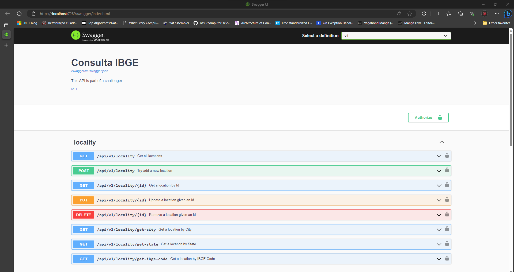

# Consulta IBGE - Balta.IO

O desafio consiste no desenvolvimento de uma WebAPI que seja capaz de realizar diferentes tipos de consultas em uma [base de dados](https://github.com/andrebaltieri/ibge), além de atender os [críterios](https://baltaio.blob.core.windows.net/temp/desafio-dotnet/01-sobre.pdf) da trilha Pleno que foram estabelecidos pelo time do Balta.IO.
## Tecnologias
- ASP.NET Core 7.0 with MinimalAPIs
- Docker (Deploy to Azure)
- SQLite
- Entity Framework 7.0
- Fluent Validation
- BCrypt (Password Hashing)
- Swagger
- JWT
- XUnit
## Documentação da API
Antes de iniciar a documentação, vale ressaltar que todas as responses foram padronizadas seguindo o seguinte modelo:
```javascript
{ "Result": object?, "Errors": List<string> }
```
Existirão duas situações na aplicação:
- success -> "result" virá sempre com algum valor e "errors" como uma lista vazia.
- fail -> "result" virá sempre como null e "errors" com uma ou mais mensagens.
Isso significa que sempre que tratarmos de "retornos" durante a documentação estamos nos referindo ao valor retornado na propriedade "result".

### Login

```
  POST /api/v1/user/login
```
```javascript
{
    "Name": string,
    "Email": string,
    "Token": string
}
```
### Cadastro de Usuário

```
  POST /api/v1/user/register
```
```javascript
{
    "Name": string,
    "Email": string,
    "Token": string
}
```

### Recuperar localidade por ID

```
  GET /api/v1/locality/{id}
```
```javascript
{
    "Id": string,
    "State": string,
    "City": string
}
```
### Adicionar uma nova localidade

```
  POST /api/v1/locality
```
```javascript
{
    "Id": string,
    "State": string,
    "City": string
}
```
### Atualizar uma localidade existente

```
  PUT /api/v1/locality/{id}
```
```csharp
  true || false: bool
```
### Remover uma localidade existente

```
  DELETE /api/v1/locality/{id}
```
```csharp
  true || false: bool
```
Agora iremos falar sobre as consultas. Algo que vale pontuar é que como paginamos as consultas, os dados serão retornados dentro de um outro objeto. Todas as consultas seguirão o seguinte formato:
```javascript
{ 
    "Result": {
        "List": List<Locality>,
        "TotalResults": int,
        "PageIndex": int,
        "PageSize": int,
        "Query": string?
    }, 
    "Errors": List<string> 
}
```
Caso ocorra algum erro durante o processo, "Result" continuará vindo como null, mas em caso de nenhum resultado ser encontrado, o "List" retornará vazio. Como o response será exatamente o mesmo para todos as rotas, iremos citar apenas as rotas.
### Recuperar todos os registros
```
  GET /api/v1/locality
```
### Recuperar pela Cidade
```
  GET /api/v1/locality/get-city
```
### Recuperar por Estado
```
  GET /api/v1/locality/get-state
```
### Recuperar pelo código IBGE
```
  GET /api/v1/locality/get-ibge-code
```
Para acessar a documentação completa gerada pelo swagger, basta executar a API como será descrito no próximo tópico.
## Rodando localmente

Clone o projeto

```psw
  git clone https://github.com/lucas404x/ConsultaIBGEChallenge1
```

Entre no diretório do projeto

```psw
  cd src
```

Instale as dependências

```psw
  dotnet restore
```

Como o JWT foi implementado no projeto, é necessário que você defina uma chave privada através do dotnet secret manager. Basta rodar o comando:

```psw
  dotnet user-secrets set "Auth:PrivateKey" "YOUR_BASE64_KEY"
```
Para gerar a chave recomendamos acessar esse [ferramenta](https://codepen.io/corenominal/pen/rxOmMJ) e, posteriormente, acessar esse [outra](https://www.base64encode.net/) para encodar a chave para base64.

Com tudo isso definido, basta rodar o seguinte comando para executar a API: 
```psw
  dotnet run
```
Se tudo ocorrer como o planejado, o ASP.NET deverá abrir a tela do swagger na rota ```https://localhost:7289```:


## Autores
- [@lucas404x](https://github.com/lucas404x)
- [@pfjunior](https://github.com/pfjunior)

